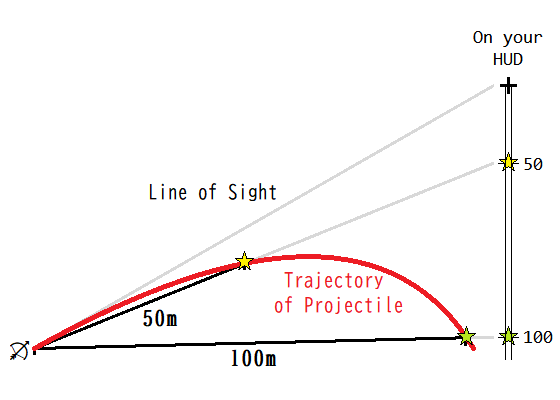

# Type19GunSight

Type 19 Gun Sight is a Minecraft modification which adds an elevation-computing gun sight for Minecraft's projectiles.

Type 19 Gun Sightは、Minecraftに仰角計算機能付きの照準器を追加するmodです。

## Downloads

- [**v1.12.2-0.0.2.0 beta**](https://github.com/Iunius118/Type19GunSight/releases/download/v1.12.2-0.0.2.0/Type19GunSight-1.12.2-0.0.2.0.jar) (requires Forge 1.12.2-14.23.5.2768)

## Description

メインハンドまたはオフハンドにコンフィグで設定した射撃アイテムを持つと、そのアイテムに対応した仰俯角の目安が画面上に描画されます（メインハンドのアイテム優先）。

### 画面上に表示される情報の見方



## Configuration

- **enable** (真偽値, default = `true`)
  - このMODを有効化します

- **maxFlightTick** (整数値 0 ～ 255, default = `255`)
  - 射撃アイテムの弾道を予測する最大時間を指定します

- **reticleColor** (整数値, default = `-1`)
  - 画面上に表示される情報の色。ARGB8888フォーマットを32bit符号付整数で表した数値
  - 例：`-1` = 白（不透明度100%）、`-872349952` = 緑（不透明度80%）

- **sightSettings** (文字列リスト)
  - 画面上に仰俯角情報を表示する射撃アイテムとその弾道特性のリスト
  - 各行はJson文字列で記述する
  - `{"ids":["item_id_1","item_id_2","..."], "v":initialVelocity[0.0 - 20.0], "r":resistanceFactor[0.0 - 2.0], "g":gravityFactor[-5.0 - 5.0]}`
    - `ids` = 次の弾道特性と関連付けるアイテムIDの文字列配列
    - `v` = 弾丸の初速（実数値, 0 ～ 20 m/tick）
    - `r` = 毎tick弾速に乗算される弾速変化率（実数値, 0 ～ 2）
    - `g` = 毎tick弾速から引かれる重力加速度（実数値, -5 ～ 5 m/tick^2）

なお、このmodでは以下の物理モデルに従って弾丸の運動をシミュレートしている：

```text
弾丸がワールド内に生成されてからの経過時間を表す整数を t (t ≧ 0) とする。

motion(t) = { {0, 0, 0}    (t = 0)
            { shooting_direction * initialVelocity    (t = 1)
            { motion(t - 1) * resistanceFactor - {0, gravityFactor, 0}    (t > 1)

pos(t) = { shooter.eye_position    (t = 0)
         { pos(t - 1) + motion(t)    (t ≧ 1)

t 時点での当たり判定は pos(t - 1) → pos(t) の区間で行われる。
```

----

Copyright (c) 2020 Iunius118
